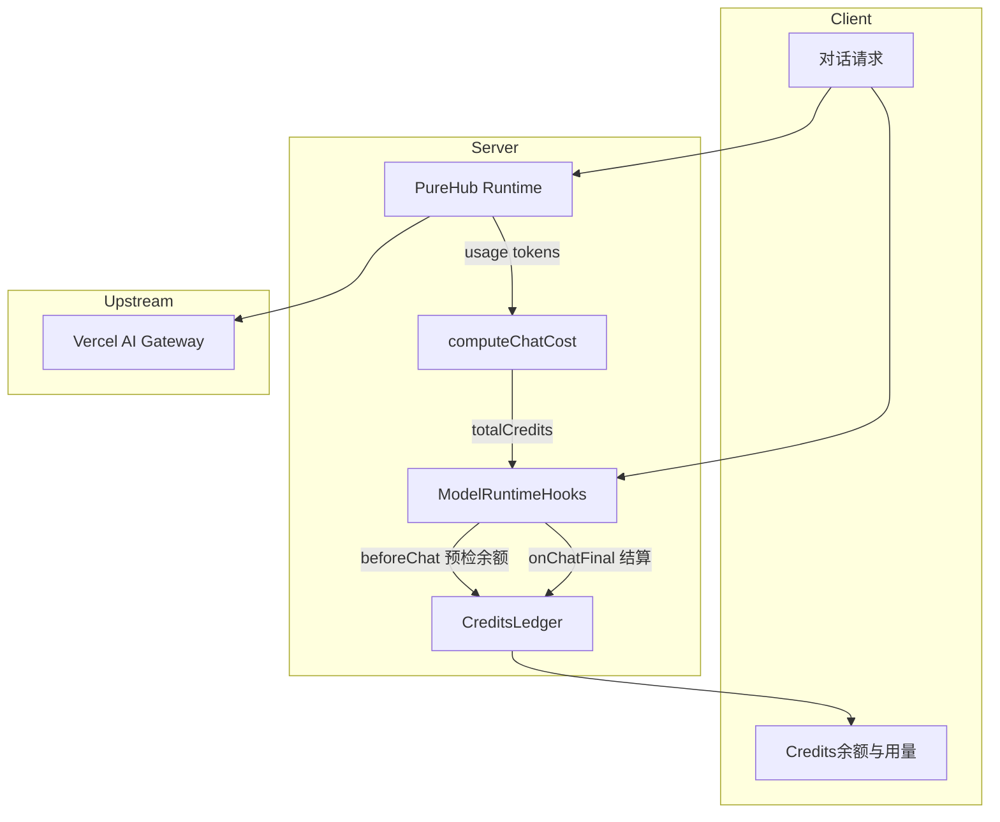

# PureChatNext 免费积分制度 · 需求规划文档

> 状态：已锁定（V1）  
> 受众：PureChatNext 实现侧  
> 本期范围：**仅需求与规格**；业务代码在 PureChatNext 项目落地

---

## 1. 背景与目标

PureChatNext 需要一套面向注册用户的 **免费积分制度**：用户无需配置 API Key 即可通过品牌服务商 **PureHub** 调用主流模型；用量按 token 计价扣减积分；积分 **每月重置**。

V1 目标：

1. 新增品牌服务商 **PureHub**，上游为 **Vercel AI Gateway**。
2. 在 `packages/model-bank` 补齐 / 核对 **purehub / openai / deepseek** 模型价格。
3. 使用 PureHub 模型成功产生 usage 后，按定价扣除用户积分。
4. 每月发放 **500,000** 免费积分；**暂不开发充值 / 订阅付费**。
5. 架构预留后续接入第三方 API 服务商的位置。

---

## 2. 术语

| 术语 | 定义 |
| --- | --- |
| **Credits（积分）** | 产品统一计量单位。换算：`1 USD = 1_000_000 credits`。 |
| **PureHub** | PureChat 官方品牌服务商，`id = purehub`。服务端持有上游 Key，终端用户不可见、不可改。 |
| **Vercel AI Gateway** | PureHub V1 上游。Base URL：`https://ai-gateway.vercel.sh/v1`，OpenAI Chat Completions 兼容。 |
| **计费周期（period）** | 自然月，标识为 `YYYY-MM`（时区见 §6.1）。 |
| **免费月度积分** | 每周期发放的 `grant = 500_000`；覆盖式重置，不滚存。 |
| **运营商成本** | PureChat 运营方在 Vercel AI Gateway 上的实际支出；与用户侧 50 万积分账户 **分离**。 |
| **自配服务商** | 用户自行配置 API Key 的 openai / deepseek / 自定义 Provider；**不扣** PureChat 免费积分。 |

---

## 3. 非目标（V1 明确不做）

| 项 | 说明 |
| --- | --- |
| Top-up / 购买积分 | UI 不出现「购买积分」；支付链路不接 |
| 自动充值 / Stripe 订阅套餐 | 可留空 router / stub，不接支付 |
| Workspace 共享积分池、成员 budget | 后续版本 |
| 图片 / 视频生成计费 | 后续版本；Chat 文本对话优先 |
| 推荐奖励积分（referral） | 后续版本 |
| 运营商「白嫖 Gateway」运维流程 | 非产品需求；可参考仓库根目录 `VERCEL_AI_GATEWAY_FREE_CREDITS.md`，与用户积分制度无关 |

---

## 4. 已锁定决策

| 项 | 决策 |
| --- | --- |
| 上游 | Vercel AI Gateway（OpenAI 兼容） |
| 用户免费额度 | **500,000 credits / 自然月**，到期清零不累积 |
| 充值 / 订阅付费 | **V1 不做** |
| 积分换算 | `1 USD = 1_000_000 credits`（约 **$0.50 / 用户 / 月**） |
| 品牌服务商 | `purehub` |
| model-bank 本期 | `purehub` 新建；`openai` / `deepseek` 核对可用 |
| 第三方服务商 | 架构预留，V1 不实现内置第三方品牌包 |
| 重置时区 | **Asia/Shanghai（UTC+8）每月 1 日 00:00**（实现时写死，禁止混用 UTC） |
| Gateway 档位 | **付费 Credits**（保留 §6.3 全量模型）；详见 [purehub-gateway-ops.md](./purehub-gateway-ops.md) |
| 微信/QQ 渠道 | V1 **不扣**用户免费积分 |

---

## 5. 架构总览



### 5.1 职责分层

| 层 | 职责 |
| --- | --- |
| **model-bank** | Provider 卡片、模型目录、`pricing` |
| **model-runtime** | 调 Gateway、解析 usage、`computeChatCost` |
| **CreditsLedger** | 发放 / 重置 / 扣减 / 余额查询 |
| **ModelRuntimeHooks** | `beforeChat` 预检、`onChatFinal` 实扣 |
| **Client UI** | 余额、已用、重置倒计时；余额不足错误卡 |

---

## 6. PureHub 服务商规格

### 6.1 Provider 元数据

| 字段 | 值 |
| --- | --- |
| `id` | `purehub` |
| `name` | `PureHub` |
| `enabled` | `true` |
| `showConfig` | `false` |
| `settings.modelEditable` | `false` |
| `settings.showAddNewModel` | `false` |
| `settings.showModelFetcher` | `false` |
| `description` | PureChat 官方通过 PureHub 接入模型，用量以 Credits 计量 |
| Runtime | OpenAI Compatible → Gateway `baseURL` |
| 鉴权 | 服务端环境变量 `AI_GATEWAY_API_KEY`（或 `PUREHUB_API_KEY` 别名），**不对终端用户暴露** |

### 6.2 模型 ID 约定

| 层 | 规则 | 示例 |
| --- | --- | --- |
| **对外展示 id** | 短 id，与 model-bank / UI 一致 | `gpt-5.4-mini` |
| **上游 Gateway id** | `vendor/model` | `openai/gpt-5.4-mini` |
| **映射** | Runtime 内维护 `displayId → gatewayId` 表 | 单测必须覆盖 |

禁止在 UI / 错误文案中暴露 Gateway 前缀，除非调试模式。

### 6.3 V1 模型名单（10 个）

覆盖美/中主力厂商 + 贵 / 中 / 廉三档，保证 50 万积分有实际可用空间。

| # | 展示 id | Gateway 上游 id（初稿） | 定位 | 能力要点 | 默认启用 |
| --- | --- | --- | --- | --- | --- |
| 1 | `gpt-5.5` | `openai/gpt-5.5` | OpenAI 旗舰 | 推理 / 工具 / 视觉 | 是 |
| 2 | `gpt-5.4-mini` | `openai/gpt-5.4-mini` | OpenAI 主力性价比 | **日常对话默认推荐** | 是 |
| 3 | `gpt-5.4-nano` | `openai/gpt-5.4-nano` | 轻量高频 | 标题生成、短问答 | 是 |
| 4 | `claude-sonnet-4-6` | `anthropic/claude-sonnet-4.6` | Claude 主力 | 长文 / Agent | 是 |
| 5 | `claude-haiku-4-5` | `anthropic/claude-haiku-4.5` | Claude 轻量 | 快速 / 免费层友好 | 是 |
| 6 | `gemini-3.1-pro-preview` | `google/gemini-3.1-pro-preview` | Google 旗舰 | 多模态 | 是 |
| 7 | `gemini-3-flash` | `google/gemini-3-flash` | Google 轻量 | 高速低成本 | 是 |
| 8 | `deepseek-v4-pro` | `deepseek/deepseek-v4-pro` | DeepSeek 旗舰 | 1M 上下文 / 推理 | 是 |
| 9 | `deepseek-v4-flash` | `deepseek/deepseek-v4-flash` | DeepSeek 轻量 | 高性价比备选 | 是 |
| 10 | `glm-5.2` | `zai/glm-5.2` | 国产高性价比 | 中文场景 / 免费层常见 | 是 |

**实现前强制校验：**

```bash
curl -s "https://ai-gateway.vercel.sh/v1/models" \
  -H "Authorization: Bearer $AI_GATEWAY_API_KEY"
```

- 核对上表 Gateway id 是否存在；不存在则替换为目录中最接近的正式 id，并同步更新映射表与文档。
- 若某模型不在 Gateway Free Tier，属 **运营商成本** 问题，与用户 50 万积分无关；可降级替换为 Free Tier 目录模型，但须保持「10 个、三档、多厂商」结构。

**套餐卡展示（`planCardModels`）：**

```ts
['deepseek-v4-pro', 'claude-sonnet-4-6', 'gemini-3.1-pro-preview', 'gpt-5.5']
```

**新产品默认模型建议：** `gpt-5.4-mini`（性价比与能力平衡）。

### 6.4 环境变量（建议）

| 变量 | 必填 | 说明 |
| --- | --- | --- |
| `AI_GATEWAY_API_KEY` | 是 | Vercel AI Gateway API Key |
| `PUREHUB_ENABLED` | 否 | 默认 `true`；关闭后隐藏 PureHub |
| `AI_GATEWAY_BASE_URL` | 否 | 默认 `https://ai-gateway.vercel.sh/v1` |

### 6.5 Runtime 行为细节

1. 仅当 `provider === 'purehub'` 时走 PureHub Runtime + 积分钩子。
2. 请求体中的 `model` 使用 **展示 id**；出站前映射为 Gateway id。
3. 上游 `429` / 限流：对用户返回可重试错误，**不扣积分**。
4. 上游鉴权失败：记运营告警，对用户返回「服务暂不可用」，**不扣积分**。
5. 流式响应：以最终 usage（或 provider 返回的累计 usage）为准结算；无 usage 则不扣。

---

## 7. model-bank 定价规格

### 7.1 范围

| Provider | V1 要求 |
| --- | --- |
| `purehub` | 新建完整 10 模型卡片 + **USD** `pricing`（与 Gateway 目录价对齐，供扣积分） |
| `openai` | 已有 pricing；实现时核对最新官方价，**缺价模型不得用于展示成本 / 不得作为 PureHub 映射源** |
| `deepseek` | 已有 **CNY** 官方价；保留 CNY；`computeChatCost` 经 `USD_TO_CNY` 换算为 USD 再乘 credits |

### 7.2 Pricing Schema

对照：`packages/model-bank/src/types/aiModel.ts`

```ts
interface Pricing {
  currency?: 'CNY' | 'USD'; // PureHub 固定 'USD'
  units: PricingUnit[];     // textInput / textOutput / textInput_cacheRead / ...
}
// strategy: 'fixed' | 'tiered' | 'lookup'
// unit: 'millionTokens' | ...
```

**PureHub 约束：**

- 统一 `currency: 'USD'`，避免「Gateway 美元价 → 再套一层汇率」的双重换算。
- 每个上线模型 **必须** 至少包含 `textInput` + `textOutput`。
- 有缓存计价时补充 `textInput_cacheRead`（及必要时 `textInput_cacheWrite`）。
- **缺价模型禁止上线**（CI / 启动校验建议：`purehub` 全量模型 `pricing.units.length > 0`）。

### 7.3 扣积分公式

```
totalCostUSD = computeChatCost(pricing, usage).totalCost   // 已换算为 USD
totalCredits = round(totalCostUSD * CREDITS_PER_DOLLAR)     // CREDITS_PER_DOLLAR = 1_000_000
```

相关实现：`packages/const/src/currency.ts`。

### 7.4 PureHub 定价初稿参考表（USD / 百万 tokens）

> **以 Gateway Models 页 / `/v1/models` 当日价为准填入实现**；下表为对照本仓 model-bank 整理的初稿，便于评审与粗算，实现时必须再校验。

| 展示 id | textInput | textOutput | cacheRead（若有） | 备注 |
| --- | ---: | ---: | ---: | --- |
| `gpt-5.5` | 5（≤272k）/ 10 | 30 / 45 | 0.5 / 1 | lookup 分档，对齐 openai 卡 |
| `gpt-5.4-mini` | 0.75 | 4.5 | 0.075 | 日常默认 |
| `gpt-5.4-nano` | 0.2 | 1.25 | 0.02 | 轻量 |
| `claude-sonnet-4-6` | 3 | 15 | 0.3 | 对齐 anthropic 卡 |
| `claude-haiku-4-5` | 1 | 5 | 0.1 | 轻量 |
| `gemini-3.1-pro-preview` | 2 | 12 | 0.2 | 对齐 gemini-3.1-pro 量级 |
| `gemini-3-flash` | 0.5 | 3 | 0.05 | 轻量 |
| `deepseek-v4-pro` | 0.435 | 0.87 | 0.0036 | Gateway 实测（2026-07-27） |
| `deepseek-v4-flash` | 0.14 | 0.28 | 0.028 | Gateway 实测 |
| `glm-5.2` | 1.4 | 4.4 | 0.26 | Gateway 实测 |

### 7.5 openai / deepseek（自配服务商）定价要求

- **openai**：保持 `packages/model-bank/src/aiModels/openai.ts` 现有 USD 结构；实现前 diff 官方价。
- **deepseek**：保持 `packages/model-bank/src/aiModels/deepseek.ts` 的 **CNY** 官方价（含 cache）；自配路径仅用于用量展示 / 成本估算，**不走 PureChat 积分扣减**。
- PureHub 上的 DeepSeek 模型定价以 **Gateway USD** 为准，**不要**把 deepseek 官方 CNY 卡直接复用到 `purehub` 卡片（避免汇率漂移导致扣分不一致）。

### 7.6 验收粗算样例

假设使用 `gpt-5.4-mini`（$0.75 / $4.5 per MTok），一次对话约 **1,000 input + 1,000 output**：

```
cost = 1000/1e6 * 0.75 + 1000/1e6 * 4.5 = 0.00075 + 0.0045 = $0.00525
credits = round(0.00525 * 1_000_000) = 5_250
```

| 场景 | 粗算 |
| --- | --- |
| 单次中等对话（上例） | ≈ 5,250 credits |
| 500,000 积分可支撑 | ≈ 95 次同档对话（仅用 mini） |
| 若全程旗舰 `claude-sonnet-4-6`（$3/$15）同 token | ≈ 18,000 credits/次 → 约 27 次 |

UI 可在积分页展示「本月约还可进行 N 次对话（按当前默认模型估算）」—— V1 可选，非必须。

---

## 8. 免费积分与扣减

### 8.1 账户规则

| 规则 | 说明 |
| --- | --- |
| 发放额度 | `grant = 500_000` |
| 首次发放 | 用户注册完成 / 首次登录就绪时，写入当前 `period` |
| 周期重置 | **Asia/Shanghai 每月 1 日 00:00**：覆盖式重置为 500,000（`used = 0`，剩余不滚存） |
| 余额计算 | `remaining = grant - used`（夹逼 ≥ 0） |
| 余额种类 | V1 仅 `free_monthly_credits`；表结构可预留 `topup_balance` 默认 0 且 UI 隐藏 |

**跨月请求边界：**

- 以 **结算时刻**（`onChatFinal`）所在 period 扣减。
- 若请求跨月开始：允许在旧 period 预检通过后完成；结算时若已进入新 period，则扣在新 period（新 period 已有 500,000 grant）。需在实现注释中写清，避免双扣。

### 8.2 扣减范围

| 请求来源 | 是否扣 PureChat 积分 |
| --- | --- |
| `provider === 'purehub'` 且成功产生 usage | **是** |
| 用户自配 openai / deepseek / 其他 | **否** |
| 无 usage 的失败 / 取消 / 上游 4xx（非业务限流文案） | **否** |
| 纯本地 Agent 工具步骤（未调 LLM） | **否** |

### 8.3 并发与扣减时序（Chat）

推荐 **预检 + 实扣**（对齐 image/video 的 chargeBefore/After 思想，Chat 可简化）：

1. **`beforeChat`**
   - 确保当前 period 行存在（懒发放 / 懒重置）。
   - 若 `remaining <= 0` → 抛 `FreePlanLimit`，不发起上游请求。
   - V1 **不做金额预扣锁**（降低复杂度）；可选：若 `remaining < MIN_RESERVE_CREDITS`（建议 `1_000`）也拒绝，防止无意义打上游。
2. **调用上游** → 得到 usage。
3. **`onChatFinal`**
   - `credits = computeChatCost(...).totalCredits`
   - 原子更新：`used = min(grant, used + credits)`（或 `UPDATE ... SET used = used + $c WHERE remaining 足够`；若并发打穿，扣至 `used = grant`，不出现负余额）。
4. **失败 / 无 usage**：不调用结算或结算 0。

**流式中途打穿：**

- 允许本次按实际 usage 扣至 0。
- **后续** PureHub 请求在 `beforeChat` 被拒绝。
- 不出现「购买积分」引导。

### 8.4 不足时行为与文案

- 错误类型：优先 `FreePlanLimit`（对照 `packages/types/src/fetch.ts`）；若需区分「余额不足覆盖该模型预估」可用 `InsufficientBudgetForModel`。
- HTTP / 客户端：与现有 PlanLimit 错误卡一致。
- **文案要求（中/英）：**
  - 说明免费积分已用尽。
  - 提示等待下月重置，或 **自行配置模型 API**。
  - **禁止**出现「购买积分 / 升级套餐 / Top-up」入口（V1）。

### 8.5 数据模型（文档级）

#### `user_credits`（必需）

| 字段 | 类型 | 说明 |
| --- | --- | --- |
| `user_id` | PK / FK | 用户 |
| `period` | `YYYY-MM` | 计费周期（上海时区） |
| `grant` | int | 本周期发放额，V1 恒 500000 |
| `used` | int | 本周期已用 |
| `updated_at` | timestamptz | 最后更新 |

唯一约束：`(user_id, period)`。

#### `credit_ledger`（V1 强烈建议）

| 字段 | 类型 | 说明 |
| --- | --- | --- |
| `id` | uuid | |
| `user_id` | | |
| `period` | | |
| `delta` | int | 负数为扣减，正数为发放 |
| `reason` | enum | `grant` / `reset` / `chat_usage` / `adjust` |
| `provider` | text | 如 `purehub` |
| `model` | text | 展示 id |
| `message_id` | text? | 幂等键之一 |
| `credits` | int | 绝对值便于展示 |
| `created_at` | timestamptz | |

**幂等：** 同一 `message_id` + `reason=chat_usage` 只入账一次，防止重试双扣。

### 8.6 展示

| 位置 | 内容 |
| --- | --- |
| 设置 / 积分页 | 剩余、本月已用、`grant`、下次重置时间倒计时 |
| 顶栏 / 侧栏（可选） | 剩余积分简要展示 |
| 用量统计 | 可复用按月 message spend；与 ledger 对账 |

i18n 对照风格：`packages/locales/src/default/subscription.ts` 中 `plans.credit.*`、`usage.credit.*`；**删除或隐藏**充值 / 套餐升级相关键的入口。

---

## 9. 第三方服务商扩展预留

V1 **不实现**新的内置第三方品牌包，但实现 PureHub 时必须遵守以下边界，避免后续返工：

| 扩展点 | 要求 |
| --- | --- |
| `ModelProvider` 枚举 | 预留增加新 id 的方式；`purehub` 与后续第三方并列 |
| `DEFAULT_MODEL_PROVIDER_LIST` | PureHub 默认启用；其他内置第三方 V1 可不注册 |
| `runtimeMap` | `purehub` 独立 runtime；未知 provider fallback 行为保持明确 |
| Env `ENABLED_*` | 新服务商用独立开关，不与 `PUREHUB_ENABLED` 耦合 |
| UI「添加服务商」 | 复用自定义 Provider（`source: 'custom'`）；用户自配 Key |
| **扣积分边界** | **仅** `provider === 'purehub'` 扣免费积分；自配 openai/deepseek/自定义 **永不**走 CreditsLedger |

后续接入第三方 API 服务商时：只加 model-bank + runtime + env，不改动积分总账语义。

---

## 10. PureChatNext 实现映射表

> 模型目录与定价统一放在 [`packages/model-bank`](../../packages/model-bank)；**不**移植完整 `model-runtime` / `business-server`。本仓 Runtime 仍为 AI SDK 直连。
>
> 运营商决策与模型校验见 [purehub-gateway-ops.md](./purehub-gateway-ops.md)。

| 能力 | PureChatNext 落地路径 |
| --- | --- |
| Provider 卡片 | [`packages/model-bank/src/modelProviders/`](../../packages/model-bank/src/modelProviders/) |
| 模型 + 定价 | [`packages/model-bank/src/aiModels/`](../../packages/model-bank/src/aiModels/)（purehub USD / openai USD / deepseek CNY） |
| Provider 枚举 | [`packages/model-bank/src/const/modelProvider.ts`](../../packages/model-bank/src/const/modelProvider.ts) |
| 成本计算 | [`packages/model-bank/src/computeChatCost.ts`](../../packages/model-bank/src/computeChatCost.ts) |
| 货币常量 | [`packages/const/src/currency.ts`](../../packages/const/src/currency.ts) |
| Runtime（OpenAI Compatible → Gateway） | [`src/libs/ai-providers/resolveClient.ts`](../../src/libs/ai-providers/resolveClient.ts) + chat 路由内 `purehub` 分支 |
| beforeChat / onChatFinal | [`src/app/api/chat/route.ts`](../../src/app/api/chat/route.ts) |
| CreditsLedger | [`packages/database/src/models/credits.ts`](../../packages/database/src/models/credits.ts) |
| Schema | [`packages/database/src/schemas/credits.ts`](../../packages/database/src/schemas/credits.ts) |
| Env | [`packages/env/src/llm.ts`](../../packages/env/src/llm.ts) |
| 错误类型 | [`packages/types/src/fetch.ts`](../../packages/types/src/fetch.ts) + [`src/libs/errors.ts`](../../src/libs/errors.ts) |
| 积分 UI（只读，无购买） | `/settings/credits` |
| Provider UI | settings provider `purehub`（无 API Key 表单） |
| 渠道 Agent | **V1 不扣**用户免费积分 |

---

## 11. 验收标准与测试清单

### 11.1 产品验收

- [ ] 新注册用户余额为 **500,000**
- [ ] 跨月（上海时区）后余额重置为 **500,000**，上月剩余不滚存
- [ ] PureHub 一次成功对话后 `used` 增加，且与 `computeChatCost` 结果一致（允许四舍五入 1 credit 误差）
- [ ] 同一 `message_id` 重试结算不双扣
- [ ] `remaining = 0` 时 PureHub 请求被拒，错误文案无「购买」
- [ ] 用户自配 openai / deepseek 在积分为 0 时仍可用
- [ ] 设置中 **无** 充值 / Top-up / 订阅购买入口
- [ ] 10 个模型均可选；每个模型有完整 USD pricing
- [ ] UI 展示重置倒计时正确（上海时区下月 1 日）

### 11.2 工程测试建议

| 用例 | 类型 |
| --- | --- |
| 展示 id ↔ Gateway id 双向映射 | 单测 |
| `computeChatCost` × PureHub 各模型定价样例 | 单测 |
| `beforeChat` 余额为 0 抛 `FreePlanLimit` | 单测 / 集成 |
| `onChatFinal` 原子扣减与幂等 | 单测 |
| 懒创建 period 行 / 跨月重置 | 单测 |
| 上游无 usage / 429 不扣分 | 集成 |
| 缺价模型启动校验失败 | 单测 |

### 11.3 上线前 Checklist

- [ ] `GET /v1/models` 校验 10 个 Gateway id
- [ ] Gateway 定价与 model-bank PureHub 卡一致（抽检）
- [ ] `AI_GATEWAY_API_KEY` 仅服务端可见
- [ ] 生产关闭任何充值入口 feature flag
- [ ] 监控：日积分消耗、上游 429 率、扣减失败率

---

## 12. 附录

### 12.1 运营商成本 vs 用户积分

| 账户 | 所有者 | 额度 | 用途 |
| --- | --- | --- | --- |
| Vercel AI Gateway Credits | PureChat 运营方 | 由 Vercel 免费层 / 采购决定 | 支付上游推理 |
| PureChat 用户 Credits | 终端用户 | 500,000 / 月 | 产品内配额与公平使用 |

二者 **不得** 混为同一余额字段。用户积分为 0 只影响 PureHub；不影响运营方 Gateway 余额展示。

### 12.2 与 Vercel Free Tier 的关系

- Gateway Free Tier 仅含部分模型，且有 rate limit；超额返回 `429`。
- 若运营方希望尽量使用 Free Tier：可在实现期把 §6.3 名单替换为 [Free Tier 目录](https://vercel.com/ai-gateway/models?freeTier=true) 中的等价模型，但须更新定价与映射，并回归 §11。
- **一旦运营方购买 Gateway Credits，可能失去每月免费层**（以 Vercel 当时政策为准）；这是运营决策，不写入用户产品文案。

### 12.3 后续版本可能项（不在 V1）

- 充值包 / 自动充值
- 订阅档位（更多月度积分）
- Workspace 共享池与成员预算
- 图片 / 视频计费（chargeBefore/After）
- 推荐奖励积分
- PureHub 模型远程配置下发

### 12.4 参考链接

- Vercel AI Gateway：https://vercel.com/docs/ai-gateway
- Gateway 定价：https://vercel.com/docs/ai-gateway/pricing
- Gateway Models：https://vercel.com/ai-gateway/models
- 运营商决策与校验：[purehub-gateway-ops.md](./purehub-gateway-ops.md)
- 本仓货币常量：`packages/const/src/currency.ts`
- 本仓成本计算：`packages/model-bank/src/computeChatCost.ts`
- 本仓模型 + 定价：`packages/model-bank/src/aiModels/`

---

## 修订记录

| 日期 | 版本 | 说明 |
| --- | --- | --- |
| 2026-07-27 | v1.0 | 初稿锁定：Gateway 上游、50 万月度积分、10 模型、不做充值 |
| 2026-07-27 | v1.1 | 锁定付费 Gateway；校验 10 模型；§10 改为本仓轻量映射 |
| 2026-07-27 | v1.2 | 模型目录与定价迁入 `packages/model-bank`（purehub / openai / deepseek） |
